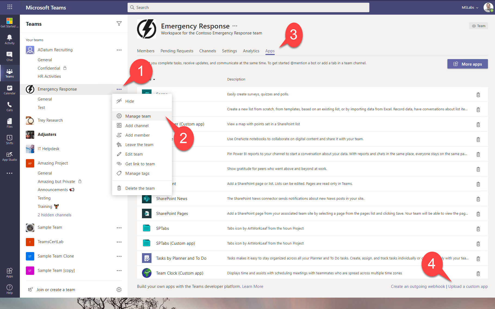
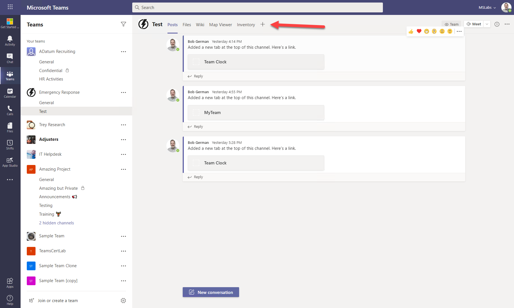
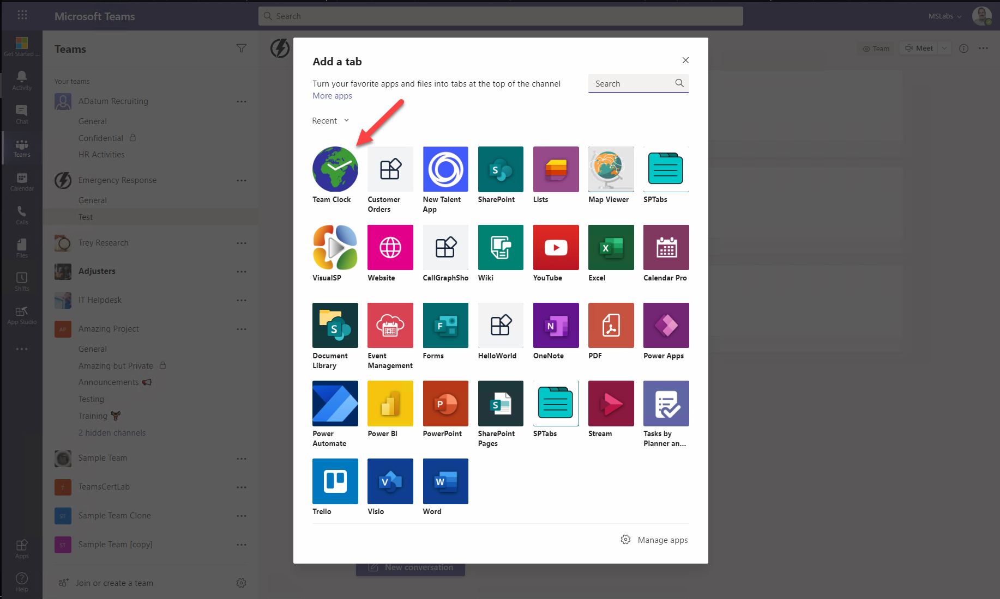
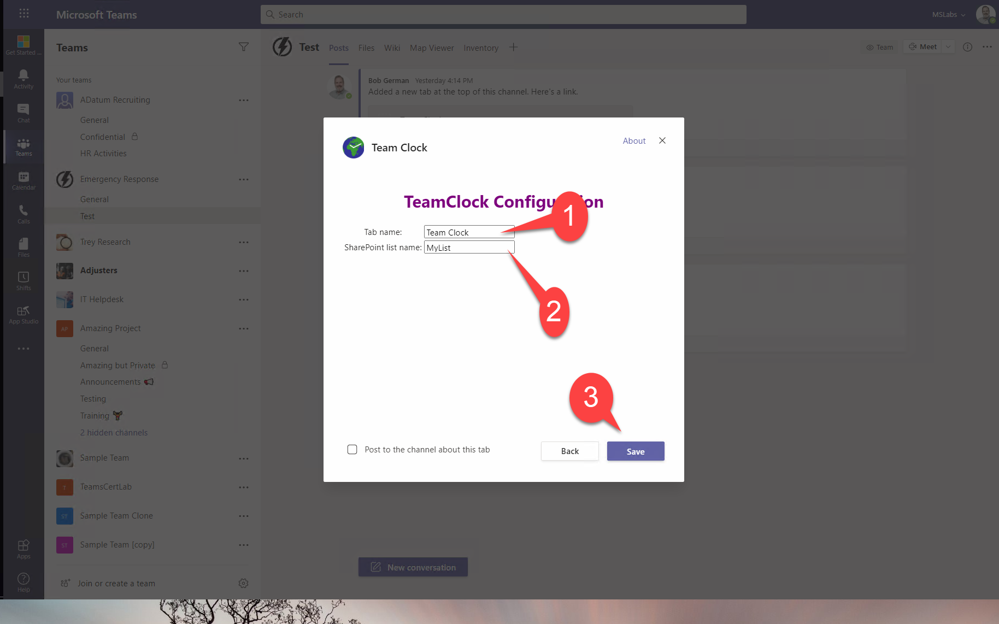
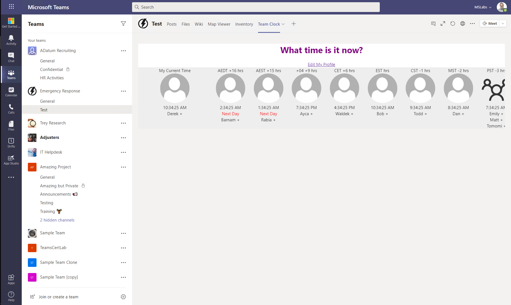

# Team Clock

## Minimum Path to Awesome

### A. Add and trust certificates

Follow the steps in [this article](https://bob1german.com/2020/10/17/setting-up-ssl-for-tabs-in-the-teams-toolkit-for-visual-studio-code/)
 * Step 1 - Follow this from the article
 * Step 2 - You do need to create the .cert file in this project folder (part a). The .env and .gitignore changes are already done (parts b and c).

### B. Install dependencies

~~~bash
npm install
~~~

### C. Build the Manifest

1. Copy the file `manifest/manifest sample.json` to a new file called `manifest/manifest.json`

2. Edit `manifest.json' and make the following global replacements

|---|---|
| <HOSTNAME> | Your hostname (such as localhost) |
| <PORT> | Your port (such as 3000) |

3. Build the manifest

~~~bash
npm run manifest
~~~

### D. Start the server

~~~bash
npm run start
~~~

Leave it running.

### E. Install the app in Teams

Find a Team where you wish to test and where you have the permission to upload an app. This requires an [App Setup Policy](https://docs.microsoft.com/en-us/MicrosoftTeams/teams-app-setup-policies) which allows "Upload custom apps" and a Team where you are an owner.

Click the elipsys to the right of the team name 1️⃣ and then "Manage team" 2️⃣. On the Manage Team screen, select the "Apps" tab 3️⃣ and then click the Upload link 4️⃣. If you don't see the upload link, then the App Policy hasn't taken effect yet (can take up to 24 hours), doesn't apply to you, or you lack permission to the Team.

Browse to the channel where you wish to install the tab and click the "+" to the right of the tabs.

Select "Team Clock".

Fill in the configuration screen with a name for the tab 1️⃣ and a name for your SharePoint list2️⃣, then click Save.3️⃣

You should see the Team clock in your channel!

## Available Scripts

This project was bootstrapped with [Create React App](https://github.com/facebook/create-react-app).

In the project directory, you can run:

### `npm run start`

Runs the app in the development mode.\
Open [http://localhost:3000](http://localhost:3000) to view it in the browser.

The page will reload if you make edits.\
You will also see any lint errors in the console.

### `npm run test`

Launches the test runner in the interactive watch mode.\
See the section about [running tests](https://facebook.github.io/create-react-app/docs/running-tests) for more information.

### `npm run build`

Builds the app for production to the `build` folder.\
It correctly bundles React in production mode and optimizes the build for the best performance.

The build is minified and the filenames include the hashes.\
Your app is ready to be deployed!

See the section about [deployment](https://facebook.github.io/create-react-app/docs/deployment) for more information.

### `npm run manifest`

Build the Teams manifest
### `npm run eject`

**Note: this is a one-way operation. Once you `eject`, you can’t go back!**

If you aren’t satisfied with the build tool and configuration choices, you can `eject` at any time. This command will remove the single build dependency from your project.

Instead, it will copy all the configuration files and the transitive dependencies (webpack, Babel, ESLint, etc) right into your project so you have full control over them. All of the commands except `eject` will still work, but they will point to the copied scripts so you can tweak them. At this point you’re on your own.

You don’t have to ever use `eject`. The curated feature set is suitable for small and middle deployments, and you shouldn’t feel obligated to use this feature. However we understand that this tool wouldn’t be useful if you couldn’t customize it when you are ready for it.

## Learn More

You can learn more in the [Create React App documentation](https://facebook.github.io/create-react-app/docs/getting-started).

To learn React, check out the [React documentation](https://reactjs.org/).
